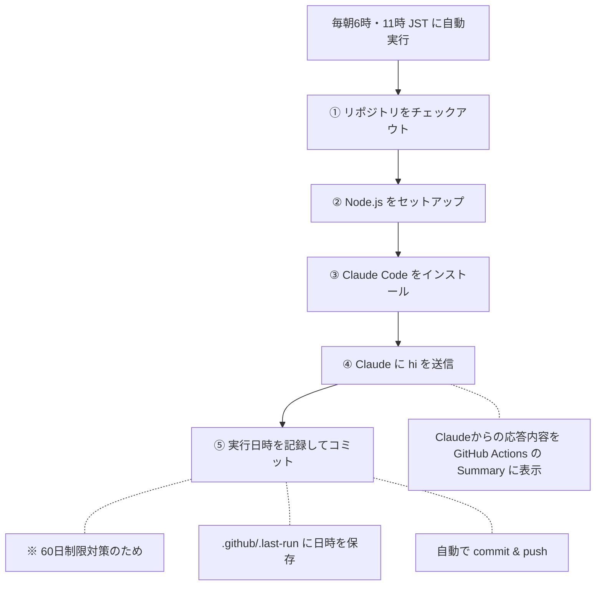

# claude-daily-wakeup
毎朝6時と11時にClaude Codeを起動して挨拶するワークフロー 

## 概要
GitHub Actionsを使って、毎朝6時と11時（JST）にClaude Codeに「hi」と送信します。
## なぜ6時なのか？
- 利用制限リセットの最適化

### Claude Codeの利用制限の仕組み
Claude Codeの利用制限は **セッション開始から5時間後** にリセットされます。

| セッション開始時刻 | リセット時刻 |
|-------------------|-------------|
| 8時台に開始 | 13:00 | | 9時台に開始 | 14:00 |

### 現状の問題（9時に出社してから開始する場合）

```mermaid
gantt
    title 9時開始の場合
    dateFormat HH:mm
    axisFormat %H時
    todayMarker off

    section 勤務時間
    出社〜退社                :done, work, 09:00, 9h

    section セッション
    .                        :done, axis, 06:00, 0h
    セッション①              :active, s1, 09:00, 5h
    セッション②              :s2, 14:00, 5h
    .                        :done, axis2, 22:00, 0h
```


→ 勤務時間中に **2セッションしか利用できない** ### 解決策（6時にセッションを開始できたら？）

```mermaid
gantt
    title 6時開始の場合
    dateFormat HH:mm
    axisFormat %H時
    todayMarker off

    section 勤務時間
    出社〜退社                :done, work, 09:00, 9h

    section セッション
    セッション①              :active, s1, 06:00, 5h
    セッション②              :s2, 11:00, 5h
    セッション③              :crit, s3, 16:00, 5h
    .                        :done, axis2, 22:00, 0h
```


→ 勤務時間中に **3セッションを利用できる**
### まとめ
| 開始時刻 | セッション数 | 勤務時間中に利用可能なセッション時間 |
|----------|-------------|-------------------------------------|
| 9時開始 | 2回 | 10時間分 |
| **6時開始** | **3回** | **15時間分（+50%）** |

このワークフローで毎朝6時に自動でセッションを開始することで、出社時には既にセッション①が進行中となり、利用効率を最大化できます。
また、11時にも自動実行することで、セッション②の開始忘れを防ぎ、確実に16時リセットを迎えられます。 **注意**: 週次リミット（weekly limit）は消費されます。普段5時間の利用制限にはかかるが週次リミットには到達していない人にとって、勤務時間中に5時間制限がかかりにくくなるメリットがあります。

## コスト最適化
週次リミット消費を最小限に抑えるため、以下の設定を行っています：
- **Haikuモデルを使用** (--model haiku): 最も軽量なモデルで実行
- **ツール無効化** (--tools ""): システムプロンプトのツール説明を削除し、トークン消費を削減 これにより、1回あたり約$0.0025程度のコストで実行できます。

## ワークフローの流れ



## ファイル構成
```
claude-daily-wakeup/
├── .github/
│   ├── .last-run                  # 最終実行日時（自動更新）
│   └── workflows/
│       └── claude-daily-wakeup.yml  # ワークフロー定義
└── README.md
```
## 60日制限対策
GitHub Actionsのcronは、リポジトリに60日間アクティビティがないと自動的に無効化されます。
この問題を回避するため、ワークフロー実行時に .github/.last-run ファイルを更新してコミットすることで、継続的なアクティビティを発生させています。

## 手動実行
GitHub Actions の画面から workflow_dispatch で手動実行も可能です。

## セットアップ手順 

### 1. リポジトリを作成
1. 以下の設定でリポジトリを作成
2. 作成後、リポジトリの **Settings** → **Collaborators and teams** で自分だけに書き込み権限があることを確認

### 2. ワークフローファイルを配置 リポジトリに以下の構成でファイルを配置します。
```
your-repo/
└── .github/
    └── workflows/
        └── daily-hi.yml    # このディレクトリのファイルをコピー
```
### 3. Claude Code の OAuth トークンを取得して GitHub Secrets に登録
※ Claude Pro または Max プランが必要です
1. ターミナルで以下を実行
```bash
   claude setup-token
```
2. ブラウザが開くので、Claudeアカウントで認証
3. 認証完了後、ターミナルにトークンが表示される
4. リポジトリの **Settings** → **Secrets and variables** → **Actions** を開く
5. **New repository secret** をクリック
6. 以下を入力して保存 - **Name**: CLAUDE_CODE_OAUTH_TOKEN - **Secret**: 手順3で表示されたトークン

### 4. 動作確認 
1. リポジトリの **Actions** タブを開く
2. **Daily Hi to Claude** ワークフローを選択
3. **Run workflow** で手動実行
4. 実行結果の **Summary** でClaudeの応答を確認
