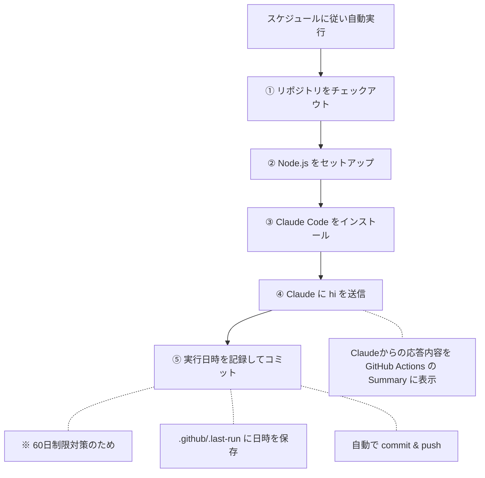

# claude-daily-wakeup
平日・休日で異なるスケジュールでClaude Codeを起動するワークフロー

## 概要
GitHub Actionsを使って、Claude Codeに「hi」と送信し、利用制限のリセットを最適化します。

## スケジュール

| 曜日 | 実行時刻 (JST) | 目的 |
|------|---------------|------|
| 平日（月〜金） | 17:00 | 退勤後〜翌朝のセッション準備 |
| 休日（土日） | 9:17 | 午前中のセッション開始（遅延対策で前倒し） |
| 休日（土日） | 15:00 | 午後のセッション開始 |

### Claude Codeの利用制限の仕組み
Claude Codeの利用制限は **セッション開始から5時間後** にリセットされます。

### 平日のスケジュール（17時実行）

```mermaid
gantt
    title 平日: 17時に自動実行
    dateFormat HH:mm
    axisFormat %H時
    todayMarker off

    section 当日
    勤務時間                  :done, work, 09:00, 8h
    自動実行(17時)            :crit, auto, 17:00, 1h

    section 翌日
    セッションリセット(22時)   :milestone, reset, 22:00, 0h
    翌朝出社時には新セッション  :active, next, 09:00, 5h
```

→ 17時に実行することで、翌朝出社時には **リセット済みの状態** で作業開始できる

### 休日のスケジュール（9:17・15時実行）
```mermaid
gantt
    title 休日: 9:17と15時に自動実行
    dateFormat HH:mm
    axisFormat %H時
    todayMarker off

    section セッション
    自動実行①(9:17)           :active, s1, 09:17, 5h
    自動実行②(15時)           :s2, 15:00, 5h
    .                        :done, axis2, 22:00, 0h
```
→ 休日も **2セッション分** を確保

> **Note**: 自動実行①はGitHub Actionsのcronスケジューラ遅延対策として、分をずらし（毎時0分→17分）＋前倒し（UTC 01:00→00:17）しています。旧設定（UTC 01:00）では2〜3時間の遅延が常態化していたため、この変更により JST 10:00前後での実行を期待しています。

**注意**: 週次リミット（weekly limit）は消費されます。普段5時間の利用制限にはかかるが週次リミットには到達していない人にとって、利用制限がかかりにくくなるメリットがあります。

## コスト最適化
週次リミット消費を最小限に抑えるため、以下の設定を行っています：
- **Haikuモデルを使用** (--model haiku): 最も軽量なモデルで実行
- **ツール無効化** (--tools ""): システムプロンプトのツール説明を削除し、トークン消費を削減 これにより、1回あたり約$0.0025程度のコストで実行できます。

## ワークフローの流れ



## ファイル構成
```
claude-daily-wakeup/
├── .github/
│   ├── .last-run                  # 最終実行日時（自動更新）
│   └── workflows/
│       └── claude-daily-wakeup.yml  # ワークフロー定義
└── README.md
```
## 60日制限対策
GitHub Actionsのcronは、リポジトリに60日間アクティビティがないと自動的に無効化されます。
この問題を回避するため、ワークフロー実行時に .github/.last-run ファイルを更新してコミットすることで、継続的なアクティビティを発生させています。

## 手動実行
GitHub Actions の画面から workflow_dispatch で手動実行も可能です。

## セットアップ手順 

### 1. リポジトリを作成
1. 以下の設定でリポジトリを作成
2. 作成後、リポジトリの **Settings** → **Collaborators and teams** で自分だけに書き込み権限があることを確認

### 2. ワークフローファイルを配置 リポジトリに以下の構成でファイルを配置します。
```
your-repo/
└── .github/
    └── workflows/
        └── daily-hi.yml    # このディレクトリのファイルをコピー
```
### 3. Claude Code の OAuth トークンを取得して GitHub Secrets に登録
※ Claude Pro または Max プランが必要です
1. ターミナルで以下を実行
```bash
   claude setup-token
```
2. ブラウザが開くので、Claudeアカウントで認証
3. 認証完了後、ターミナルにトークンが表示される
4. リポジトリの **Settings** → **Secrets and variables** → **Actions** を開く
5. **New repository secret** をクリック
6. 以下を入力して保存 - **Name**: CLAUDE_CODE_OAUTH_TOKEN - **Secret**: 手順3で表示されたトークン

### 4. 動作確認 
1. リポジトリの **Actions** タブを開く
2. **Daily Hi to Claude** ワークフローを選択
3. **Run workflow** で手動実行
4. 実行結果の **Summary** でClaudeの応答を確認
